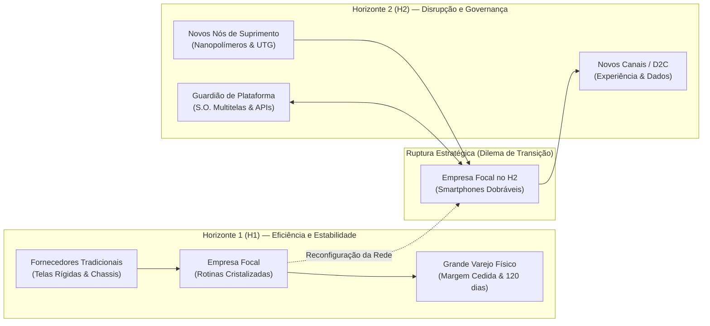
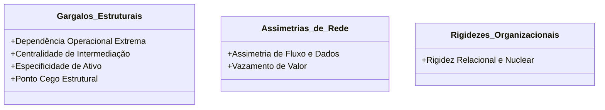
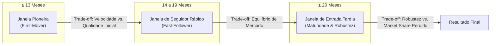
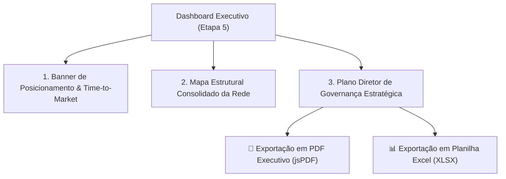
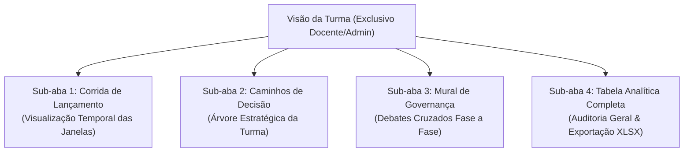

# Manual e Guia de Estudo: Simulação de Evolução de Redes de Negócios (Transição H1 → H2)

Este manual serve como material de apoio didático, guia de operação e orientação teórica para estudantes e professores dos cursos de Administração, Sistemas de Informação, Engenharia de Produção, Gestão Estratégica e Inovação. Ele detalha a dinâmica do módulo **Evolução da Rede**, a modelagem teórica de redes interorganizacionais, os impactos temporais no **Time-to-Market**, as **características estruturais da cadeia** e as diretrizes para elaboração de propostas de **Governança Estratégica**.

---

## 1. Visão Geral e Fundamentos Teóricos

### O Desafio da Transição Interorganizacional
A sobrevivência das empresas contemporâneas depende de sua capacidade de gerenciar concomitantemente o negócio principal estabilizado — **Horizonte 1 (H1)** — e as inovações radicais que redefinirão a indústria — **Horizonte 2 (H2)**.

No entanto, uma organização raramente inova de forma isolada. A transição de um produto maduro para uma ruptura tecnológica impõe a **reconfiguração completa de sua rede de parceiros, fornecedores, canais e plataformas**. 

### O Case Central da Simulação
Na simulação, os grupos assumem o papel do comitê executivo de uma fabricante multinacional líder em smartphones tradicionais (telas planas rígidas, canal massivo e sistemas já amortizados). A alta administração emitiu uma diretriz inegociável: **ingressar com urgência no mercado de smartphones dobráveis (H2)**.

* **Linha de Base da Indústria (Baseline):** **18 meses** (tempo médio estimado para um ciclo completo de P&D, homologação e lançamento no setor de eletrônicos de consumo).
* **Impacto das Decisões:** Cada escolha estratégica altera o cronograma final (adicionando ou antecipando meses no *Time-to-Market*) e ativa características estruturais benéficas ou críticas na rede.
* **Missão do Grupo:** Tomar as 4 decisões sequenciais, defender os *trade-offs* assumidos e redigir propostas concretas de governança para mitigar cada gargalo ativado.

---

## 2. As Três Dimensões da Governança da Rede

Ao deliberar sobre as etapas da simulação, a equipe deve balancear continuamente três dimensões estratégicas:

1. **Captura e Retenção de Valor (Eficiência Econômica vs. Riscos de Transação):**
   * Avalia a divisão do excedente econômico entre a empresa focal e seus parceiros. Decisões que dependem de terceiros com ativos exclusivos podem acarretar **vazamento de valor**, pagamento desproporcional de margens ou retenção de dados essenciais por intermediários.
2. **Soberania e Autonomia Relacional (Poder de Barganha vs. Dependência):**
   * Avalia o grau de controle sobre propriedade intelectual, segredos industriais e rotas alternativas de abastecimento. Escolhas cômodas podem enclausurar a empresa em **dependências operacionais extremas** ou subordiná-la a nós dominantes com alta **centralidade de intermediação**.
3. **Dinâmica e Tempo de Resposta (Velocidade vs. Robustez):**
   * Avalia a agilidade em prototipar, homologar e chegar à vitrine (*Time-to-Market*). Soluções que constroem tudo internamente garantem soberania, mas podem atrasar o produto a ponto de perder a janela pioneira de mercado.

---

## 3. Dicionário Conceitual: Características Estruturais da Rede

O modelo pedagógico do simulador baseia-se em conceitos clássicos de **Teoria dos Custos de Transação (Williamson)**, **Capacidades Dinâmicas e Ativos Complementares (Teece)** e **Teoria de Redes e Enraizamento (Granovetter / Gulati)**. 

As características estruturais ativadas durante a jornada dividem-se em três blocos:

### 1. Gargalos Estruturais

#### ⛓️ Dependência Operacional Extrema
* **Definição:** Condição de vulnerabilidade crítica na qual a organização concentra o fluxo de um insumo, recurso ou serviço essencial em um único parceiro externo, com ausência de rotas redundantes e sob custos proibitivos de substituição (*high switching costs*).
* **Risco Gerencial:** Paralisação operacional imediata em caso de colapso, falência, greve ou quebra de contrato pelo parceiro monopolista.
* **Diretriz de Governança:** Contratos de contingência (*dual-sourcing*), auditorias de saúde financeira e cláusulas de transferência assistida de tecnologia.

#### 🚪 Centralidade de Intermediação (*Betweenness Centrality*)
* **Definição:** Ocorre quando um ator posiciona-se estrategicamente no meio das pontes da rede, atuando como guardião de passagem (*gatekeeper*). Esse nó detém o poder de ditar padrões, filtrar fluxos, cobrar pedágios e regular o acesso ao cliente ou a outros fornecedores.
* **Risco Gerencial:** Perda de autonomia decisória e subordinação a regras unilaterais de terceiros (ex.: taxas de app stores ou imposições de grandes redes de varejo).
* **Diretriz de Governança:** Alianças multilaterais com concorrentes para criar padrões abertos, desintermediação pontual e diversificação de rotas de acesso.

#### 🔒 Especificidade de Ativo
* **Definição:** Investimentos pesados dedicados exclusivamente para viabilizar determinada relação ou produto (maquinário sob medida, ferramental específico, software proprietário ou equipes treinadas) que não podem ser reempregados em outra atividade sem perda drástica de valor.
* **Risco Gerencial:** Risco de "sequestro de valor" (*hold-up problem*): o parceiro sabe que a empresa tem custos afundados (*sunk costs*) e pode renegociar preços em bases desfavoráveis.
* **Diretriz de Governança:** Cláusulas contratuais de amortização compartilhada, copropriedade de ferramental e acordos de longo prazo com garantias reais.

#### 👁️‍🗨️ Ponto Cego Estrutural (Baixa Visibilidade)
* **Definição:** Grau reduzido de transparência e rastreabilidade sobre nós posicionados além da fronteira contratual primária da empresa (subcontratados de camadas 2 e 3, mineradoras de matérias-primas e provedores de frete de última milha).
* **Risco Gerencial:** Escândalos reputacionais por práticas trabalhistas/ambientais ilícitas de subfornecedores ou rupturas súbitas de componentes sem aviso prévio.
* **Diretriz de Governança:** Plataformas de rastreabilidade digital (blockchain/IoT), cláusulas mandatórias de homologação de subcontratados e auditorias não anunciadas em fornecedores indiretos.

---

### 2. Assimetrias de Rede

#### 📊 Assimetria de Fluxo e Captura de Valor
* **Definição:** Ocorre quando o contato com o cliente final é intermediado por um parceiro que retém a telemetria, dados transacionais e comportamento de uso, repassando à fabricante apenas o faturamento e pedidos consolidados de reposição.
* **Risco Gerencial:** Comoditização da empresa focal. Sem conhecer os comportamentos e dores reais do usuário, a empresa perde a capacidade de inovar e vira mera montadora fabril.
* **Diretriz de Governança:** Cláusulas contratuais de compartilhamento obrigatório de dados (*data-sharing*), programas de fidelidade e canais proprietários de pós-venda.

#### 💸 Vazamento de Valor (Ativos Complementares Especializados)
* **Definição:** A empresa é pioneira na inovação, mas o parceiro detém os **Ativos Complementares Especializados** indispensáveis para transformar essa invenção em lucro (redes de lojas nobres, crediário próprio ou marca de alto luxo). Segundo o modelo de David Teece, quem detém o ativo complementar raro captura a maior parte da renda econômica gerada pela inovação.
* **Risco Gerencial:** Diluição severa da margem de lucro por meio de comissões leoninas ou royalties excessivos.
* **Diretriz de Governança:** Royalties decrescentes por volume, parcerias baseadas em *equity joint venture* e construção gradual de ativos próprios.

---

### 3. Rigidezes Organizacionais

#### ⚓ Rigidez Relacional e Nuclear (*The Embeddedness Paradox*)
* **Definição:** O paradoxo do enraizamento excessivo: laços fortes, confiáveis e históricos do H1 tornam-se prisões relacionais na transição para o H2. Rotinas e capacidades que foram o motor do sucesso no passado viram barreiras cognitivas e contratuais intransponíveis para a disrupção.
* **Risco Gerencial:** Lentidão para inovar decorrente da insistência em tentar "adaptar" parceiros e ferramentas obsoletas a exigências tecnológicas de ponta.
* **Diretriz de Governança:** Estruturação de unidades ambidestras autônomas, equipes de inovação apartadas da operação do dia a dia e rotação programada de parceiros.

---

## 4. Estrutura da Jornada: As 4 Fases de Decisão

A simulação conduz a equipe por quatro fases consecutivas. Em cada fase, a interface apresenta o **Dilema Estratégico**, o **Diagnóstico Inicial Herdado da Rede**, o **Dossiê de Pesquisa & Debate** e as **3 Opções de Arquétipos Estratégicos**.

Ao selecionar uma opção, o grupo é obrigado a preencher dois campos essenciais:
1. **Desafio de Governança:** Solução prática e protocolar para mitigar o gargalo ativado pela escolha.
2. **Justificativa Estratégica:** Fundamentação dos motivos da escolha e dos trade-offs aceitos pela equipe.

---

### 🔹 Fase 1: Domínio da Tecnologia de Hardware
* **Subtítulo:** Telas Flexíveis e Mecânica de Dobradiça.
* **Contexto do Dilema:** A física das telas dobráveis (raio de curvatura, vinco, penetração de micropartículas na dobradiça) rompe radicalmente com as telas rígidas de vidro do H1. A decisão define a viabilidade técnica e o ritmo de entrega do protótipo industrial.
* **Diagnóstico Herdado:**
  * `Rigidez Relacional`: Laços históricos com fornecedores de telas planas rígidas.
  * `Ponto Cego Estrutural`: Zero visibilidade sobre fundições de nanopolímeros e ligas metálicas (camadas 2 e 3).
* **Dossiê de Pesquisa Recomendado:** Caso do lançamento do primeiro *Galaxy Fold (2019)*, falhas de engenharia preliminares, ruptura por poeira e descolamento de película protetora.

| Opção | Arquétipo | Título da Estratégia | Impacto Temporal | Características Ativadas na Rede | Diagnóstico Técnico |
| :---: | :--- | :--- | :---: | :--- | :--- |
| **1A** | Co-desenvolvimento Relacional (Tier 2) | Co-desenvolvimento com Parceiro Histórico do H1 | **+4 meses** | • Dependência Operacional • Especificidade de Ativo • Rigidez Relacional | Aproveita a confiança mútua e resguarda segredos industriais, mas estica o cronograma pela lenta curva de reconversão fabril do parceiro tradicional. |
| **1B** | Verticalização Deep Tech (Autárquica) | Fábrica e P&D Proprietário de Telas e Dobradiças | **+8 meses** | • Especificidade de Ativo Máxima • Visibilidade Total (Sem Ponto Cego) • Blindagem contra Vazamento de Valor | Soberania tecnológica absoluta e eliminação de intermediários, à custa de enorme imobilização de capex e atraso significativo no cronograma. |
| **1C** | Consórcio de Inovação Aberta (Ecossistema) | Consórcio Aberto com Startups de Polímeros | **-4 meses** | • Ruptura com Rigidez Relacional • Vazamento de Valor (Apropriabilidade Fraca) • Ponto Cego Estrutural (Tier 2/3) | Acelera radicalmente a entrega ao incorporar protótipos já testados, aceitando riscos de perda de exclusividade e falta de controle sobre subcontratados. |

---

### 🔹 Fase 2: Arquitetura de Software e Interface
* **Subtítulo:** Adaptação do Sistema Operacional e Multitelas.
* **Contexto do Dilema:** O dobrável exige continuidade visual instantânea entre tela externa fechada e tela interna expandida, além de multitarefa avançada (3 janelas ativas simultâneas). O ecossistema global é controlado pelo dono da plataforma do sistema operacional.
* **Diagnóstico Herdado:**
  * `Centralidade de Intermediação`: O dono da plataforma global de SO dita os padrões de APIs e as regras da loja de apps.
  * `Assimetria de Fluxo de Dados`: A telemetria e o comportamento de consumo fluem para o dono do SO, deixando a fabricante alheia ao cliente digital.
* **Dossiê de Pesquisa Recomendado:** Estratégia da Samsung com a interface proprietária *One UI* e a resposta da Huawei com o *HarmonyOS* após as restrições geopolíticas de 2019.

| Opção | Arquétipo | Título da Estratégia | Impacto Temporal | Características Ativadas na Rede | Diagnóstico Técnico |
| :---: | :--- | :--- | :---: | :--- | :--- |
| **2A** | Subordinação a Nó Dominante (Plataforma Padrão) | Subordinação ao SO Padrão Global (Android AOSP/GMS) | **-4 meses** | • Centralidade de Intermediação Consolidada • Assimetria de Fluxo e Perda de Dados • Baixa Especificidade de Ativo | Lançamento rápido em modelo *plug-and-play*, transferindo a captura de valor sobre os dados digitais para o nó dominante da plataforma. |
| **2B** | Ecossistema Digital Proprietário (Diferenciação) | UI/UX Proprietária com Comunidade Dedicada | **+5 meses** | • Redução de Assimetria de Dados • Alta Especificidade de Ativo de Software • Dependência Operacional Interna | Conquista diferenciação de experiência e controle da telemetria, exigindo alto investimento contínuo e suporte técnico direto a desenvolvedores. |
| **2C** | Inércia Nuclear do H1 (Adaptação Mínima) | Adaptação Interna do Firmware Legado do H1 | **+0 meses** | • Rigidez Nuclear e Relacional • Assimetria de Percepção de Valor • Preservação de Recursos Financeiros | Economia orçamentária e cumprimento estrito do cronograma, com alto risco de frustrar o consumidor final por uma experiência de multitelas engessada. |

---

### 🔹 Fase 3: Escoamento e Canais de Distribuição
* **Subtítulo:** Logística de Valor e Conflito de Canais.
* **Contexto do Dilema:** O produto possui tíquete ultra-premium (> R$ 8.000) e demanda experimentação tátil antes da compra. Os canais herdados do H1 (redes varejistas e grandes operadoras) impõem margens de até 40% e prazos de pagamento de 120 dias.
* **Diagnóstico Herdado:**
  * `Centralidade de Intermediação`: Grandes varejistas controlam a visibilidade nas vitrines físicas e no balcão.
  * `Vazamento de Valor`: O varejo detém os Ativos Complementares de capilaridade e crediário, apropriando-se de grande parte do lucro.
* **Dossiê de Pesquisa Recomendado:** Modelo de distribuição da *Apple* (Lojas Flagship próprias com atendimento consultivo integradas a revendedores autorizados) e riscos de conflito de canais ao abrir canais digitais próprios.

| Opção | Arquétipo | Título da Estratégia | Impacto Temporal | Características Ativadas na Rede | Diagnóstico Técnico |
| :---: | :--- | :--- | :---: | :--- | :--- |
| **3A** | Canal Tradicional de Massa (Varejo e Operadoras H1) | Canais de Varejo Tradicionais e Operadoras | **+3 meses** | • Centralidade de Intermediação • Vazamento de Valor Comercial • Assimetria de Dados do Comprador • Preservação da Rigidez Relacional | Capilaridade imediata em milhares de pontos de venda sem custos imobiliários próprios, aceitando perda expressiva de margem e desconhecimento do comprador. |
| **3B** | Desintermediação Digital (D2C e Logtechs) | Estratégia D2C Exclusiva via E-commerce e Logtechs | **-3 meses** | • Eliminação de Intermediários Comerciais • Captura Total de Margem e Dados • Dependência Operacional da Malha Logística • Ponto Cego na Última Milha | Apropriação integral do lucro e dos dados do cliente, atraindo extrema vulnerabilidade a furtos de carga, atrasos logísticos e conflito com parceiros do H1. |
| **3C** | Modelo Híbrido Sensorial (Quiosques Flagship) | Quiosques Conceito e Flagships em Shoppings Nobres | **+4 meses** | • Alta Visibilidade da Experiência Sensorial • Especificidade de Ativo Físico e Procedural • Equilíbrio de Intermediação | Resolve a barreira do toque e da experimentação física preservando a imagem da marca, absorvendo pesada rigidez de custos fixos de locação comercial. |

---

### 🔹 Fase 4: Go-to-Market, Narrativa e Posicionamento
* **Subtítulo:** Construção da Marca e Percepção de Valor.
* **Contexto do Dilema:** O produto está fabricado e testado. Contudo, o público enxerga a empresa com a reputação funcional e popular herdada do H1 e desconfia da durabilidade da tela flexível.
* **Diagnóstico Herdado:**
  * `Vazamento de Valor Simbólico`: Ausência de Ativos de Reputação de superluxo para justificar um preço acima de R$ 8.000.
  * `Rigidez Relacional`: Contrato ativo com agência de publicidade tradicional do H1, focada em promoções de massa e varejo.
* **Dossiê de Pesquisa Recomendado:** Caso da edição especial *Samsung Galaxy Z Flip Thom Browne Edition* versus campanhas tradicionais de TV; legitimidade através de criadores independentes de tecnologia (*tech reviewers*).

| Opção | Arquétipo | Título da Estratégia | Impacto Temporal | Características Ativadas na Rede | Diagnóstico Técnico |
| :---: | :--- | :--- | :---: | :--- | :--- |
| **4A** | Aliança Simbólica de Prestígio (Co-branding de Luxo) | Co-branding com Grife ou Marca de Alto Luxo | **+3 meses** | • Vazamento de Valor Financeiro (Royalties) • Acesso a Ativos de Reputação Raros • Especificidade de Ativo de Marca | Aquisição instantânea de prestígio no segmento nobre e legitimação do preço elevado, cedendo royalties vultosos e autonomia sobre a estética da campanha. |
| **4B** | Continuidade Institucional (Agência Histórica H1) | Campanha de Massa com Agência Tradicional do H1 | **-1 mês** | • Rigidez Relacional na Comunicação • Retenção de 100% da Receita (Sem Royalties) • Baixa Especificidade de Ativos | Alinhamento rápido e sem custos adicionais de licenciamento, sob risco de enfraquecer o posicionamento do produto pela linguagem genérica de massa. |
| **4C** | Descentralização da Narrativa (Comunidade & Early Adopters) | Comunidade Tech, Early Adopters e Reviewers | **-2 meses** | • Visibilidade Orgânica da Rede • Ruptura com a Mídia Convencional • Exposição a Riscos de Reputação | Validação técnica legítima perante compradores inovadores, aceitando a total perda de controle da mensagem perante falhas que venham a ser expostas na web. |

---

## 5. Dinâmica do Time-to-Market e Janelas de Mercado

Ao término das 4 etapas, o motor aritmético consolida os acréscimos e subtrações sobre a linha de base de 18 meses:

$$\text{Tempo Total de Lançamento} = 18 + \Delta_1 + \Delta_2 + \Delta_3 + \Delta_4$$

O resultado posiciona o grupo em uma de três **Janelas de Mercado**:

### 1. 🚀 Janela Pioneira (*First-Mover*): $\le 13$ Meses
* **Vantagens Competitivas:** A empresa dita a categoria, obtém gigantesca cobertura orgânica na imprensa e define o padrão de referência na mente do consumidor.
* **Trade-off e Desafios:** Opera com cadeias de suprimentos e materiais em estágio embrionário de maturação industrial.
* **Exigência de Governança:** Governança preventiva de qualidade extrema, gestão ágil de suporte técnico e protocolos de contenção de crises de garantia.

### 2. ⚖️ Janela de Seguidor Rápido (*Fast-Follower*): 14 a 19 Meses
* **Vantagens Competitivas:** Equilíbrio ótimo entre velocidade de mercado e maturação da tecnologia. Permite aprender com os erros e recolhimentos de produtos (*recalls*) dos concorrentes pioneiros.
* **Trade-off e Desafios:** Exige capacidade de adaptação contínua para não se distanciar do líder sem inflacionar o orçamento.
* **Exigência de Governança:** Monitoramento constante de inteligência competitiva e contratos ágeis com cláusulas de atualização tecnológica contínua.

### 3. 🛡️ Janela de Maturidade e Entrada Tardia: $\ge 20$ Meses
* **Vantagens Competitivas:** O smartphone chega ao mercado com engenharia refinada, sem vincos aparentes na tela, com dobradiça blindada e taxas de defeito próximas de zero.
* **Trade-off e Desafios:** Os concorrentes já conquistaram os *early adopters* e ocuparam o espaço nobre das vitrines e canais de distribuição.
* **Exigência de Governança:** Ações comerciais agressivas, trade marketing diferenciado e governança de custos para viabilizar preços de entrada atrativos.

---

## 6. O Dashboard Executivo e Entregáveis do Grupo

Ao atingir a etapa 5, a interface desbloqueia o **Dashboard Executivo**, que consolida o resultado do trabalho em três blocos operacionais:

### 1. Banner de Posicionamento & Indicadores-Chave
* Exibe a insígnia da janela de mercado alcançada, o cronograma final em meses, a contagem de gargalos estruturais e o somatório de tensões relacionais acumuladas.

### 2. Mapa Estrutural da Rede de Negócios
* Reúne todas as características ativadas ao longo das 4 escolhas, identificando a fase de origem, a categoria estrutural e o efeito sobre o ecossistema da empresa.

### 3. Plano Diretor de Governança Estratégica
* Área onde a equipe revisa, refina e salva as ações de governança formuladas para as 4 etapas. O botão **Salvar Revisões de Governança 💾** persiste as alterações no Firestore em tempo real.

### 4. Relatórios Executivos Oficiais (Entregáveis de Avaliação)
* **Relatório Executivo em PDF:** Gera um documento profissional em formato A4 diagramado com cabeçalho institucional, sumário executivo, cartões de indicadores, matriz comparativa de fases e transcrição do plano de governança.
* **Dossiê em Planilha Excel (.xlsx):** Arquivo com três abas estruturadas (*Dossiê Executivo*, *Decisões e Governança* e *Mapa Estrutural da Rede*), adequado para análises quantitativas e cruzamentos pelo docente.

---

## 7. Guia do Docente: Visão Geral da Turma e Mediação de Debates

Quando o usuário autenticado possui o papel de **Professor** ou **Administrador**, o módulo exibe a aba superior **Visão da Turma**. Esse painel oferece recursos completos para conduzir a dinâmica pedagógica em sala:

### As 4 Visões do Painel Docente

1. **Sub-aba "Corrida de Lançamento" (Time-to-Market):**
   * Apresenta o ranking temporal dos grupos em formato de corrida horizontal. O professor visualiza instantaneamente quem lidera o mercado como pioneiro, quem optou pela robustez tardia e a média aritmética de meses da turma inteira.
2. **Sub-aba "Caminhos de Decisão" (Árvore de Escolhas):**
   * Gráfico de dispersão e distribuição das decisões tomadas pela sala em cada etapa (ex.: quantos grupos verticalizaram a tela na Fase 1 vs. quantos optaram por consórcio aberto). Excelente ferramenta para provocar debates de estratégia comparada.
3. **Sub-aba "Mural de Governança" (Plenária e Debates Cruzados):**
   * Permite selecionar uma das 4 fases e projetar lado a lado as ações de governança redigidas por cada grupo. O professor pode convidar grupos com escolhas opostas para defenderem como mitigaram as vulnerabilidades geradas.
4. **Sub-aba "Tabela Analítica Completa" & Exportação da Turma:**
   * Lista todos os grupos cadastrados com filtros por status (*Lançados*, *Em Andamento*, *Todos*). Conta com botão exclusivo para **Exportar Dados da Turma Inteira (.xlsx)**, gerando uma planilha consolidada com notas, tempos e textos para lançamento de menções no sistema acadêmico.

> [!TIP]
> **Acesso Exclusivo Docente — Reinicialização de Rodadas:** Caso o professor deseje aplicar uma segunda rodada com cenários macroeconômicos alterados ou corrigir desvios graves de preenchimento, o botão **Reiniciar Simulação** na tela de diagnóstico permite zerar com segurança os dados do grupo selecionado.

---

## 8. Rubrica Pedagógica de Avaliação de Governança

Para orientar a correção pelo professor e guiar o refinamento pelos alunos, adota-se a seguinte rubrica para avaliação da **Justificativa Estratégica** e da **Ação de Governança**:

| Critério | Insuficiente (D) | Básico / Operacional (C) | Tático / Bom (B) | Estratégico / Excelente (A) |
| :--- | :--- | :--- | :--- | :--- |
| **Compreensão dos Trade-offs** | Justifica a opção apenas afirmando que "era a mais rápida" ou "a melhor", ignorando desvantagens. | Cita vagamente que a opção custará mais ou demorará mais, sem vincular a variáveis de rede. | Identifica com clareza o ganho imediato e a desvantagem absorvida na cadeia de suprimentos. | Analisa com profundidade a assimetria gerada, correlacionando o impacto em tempo com custos afundados e captura de valor. |
| **Ação de Governança Proposta** | Texto vago ou nulo (ex.: "faremos reuniões semanais" ou "conversaremos com o parceiro"). | Medidas puramente genéricas (ex.: "colocar multa no contrato"). | Desenvolve cláusulas de contingência estruturadas (ex.: auditorias de qualidade, SLA com penalidades e estoque regulador). | Estrutura governança interorganizacional robusta (comitês bilaterais de governança, equity joint ventures, plataformas de dados compartilhados ou auditorias de conformidade com garantia real). |
| **Coerência Sistêmica** | As escolhas das 4 fases contradizem-se (ex.: opta por modelo autárquico na Fase 1 e terceirização passiva na Fase 2). | Pequenos desajustes de narrativa entre o posicionamento de marca e a cadeia logística. | Decisões alinhadas a um arquétipo geral predominante (foco em velocidade ou foco em soberania). | Visão executiva coesa do início ao fim; as ações de governança de fases anteriores preparam o terreno para as etapas subsequentes. |

---

## 9. Roteiro Sugerido para Dinâmica em Sala de Aula (90 a 120 min)

1. **Apresentação e Ambientação (15 min):**
   * O professor introduz o case da transição H1 para H2, apresenta a linha de base de 18 meses e revisa as 7 características estruturais da rede.
2. **Deliberação e Rodada de Decisões em Grupo (40 a 50 min):**
   * As equipes de alunos reúnem-se, analisam os dossiês de pesquisa de cada etapa e realizam as escolhas das Fases 1 a 4.
   * Obrigatoriedade de preencher a justificativa e o desafio de governança antes de liberar o avanço de fase.
3. **Exploração do Dashboard e Emissão do Relatório (15 min):**
   * Cada grupo acessa a etapa 5, analisa sua janela de mercado alcançada, ajusta o plano de governança e faz o download do relatório oficial em PDF.
4. **Plenária de Confronto e Debates com o Painel da Turma (20 a 30 min):**
   * O professor projeta a tela **Visão da Turma**, exibe a **Corrida de Lançamento** e abre o **Mural de Governança** para comparar as soluções dos pioneiros contra os grupos de entrada tardia.
