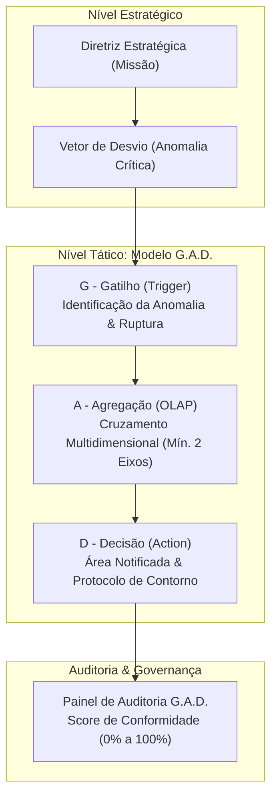

# Guia de Estudo: Modelagem Tática de Sistemas de Informação (Matriz G.A.D.)

Este guia serve como material de apoio didático e orientação técnica para estudantes de Administração, Sistemas de Informação, Controladoria e Engenharia de Produção. Ele detalha os conceitos de **Gestão Tática orientada a Dados**, a arquitetura de **Gatilhos de Ruptura**, a visão multidimensional analítica (**OLAP**) e os protocolos de **Tomada de Decisão Automatizada** estruturados na **Matriz Tática (G.A.D.)**.

---

## 1. Estrutura Conceitual da Matriz Tática (G.A.D.)

Enquanto a **Matriz Transacional** foca na execução diária, integridade e conformidade de cada operação indivisível (nível operacional), a **Matriz Tática** conecta o plano corporativo (nível estratégico) à monitoria contínua da performance organizacional através do modelo **G.A.D.**:



### O que significa G.A.D.?
* **G (Gatilho):** A regra matemática e temporal que detecta quando um indicador saiu da normalidade planejada.
* **A (Agregação):** A capacidade de cruzar dimensões analíticas em cubos de decisão (OLAP - *Online Analytical Processing*) para localizar a raiz do desvio.
* **D (Decisão):** A governança da resposta de negócio: quem deve agir e qual procedimento operacional padrão deve ser executado de imediato.

---

## 2. Dicionário de Campos e Instruções de Preenchimento

---

### 🎯 Nível 1: Diretrizes Estratégicas e Vetores de Desvio

#### 1. Diretriz Estratégica (Missão)
* **Conceito:** O objetivo de alto nível, meta macro ou vetor de sobrevivência definido pela alta administração da empresa.
* **O que o aluno deve pensar:** *"Qual é o grande objetivo corporativo que precisa ser defendido ou atingido a qualquer custo?"*
* **Exemplos Corretos:** 
  * `Defender Market Share de vendas online com rentabilidade mínima de 15%`.
  * `Garantir nível de serviço logístico (OTIF) acima de 98% nas capitais`.
  * `Reduzir a taxa de evasão de clientes (Churn Rate) para menos de 2% ao mês`.
* **Evitar:** Metas vagas como `Vender mais` ou `Melhorar a empresa`.

#### 2. Vetor de Desvio
* **Conceito:** O evento específico de risco, falha ou anomalia operacional capaz de comprometer diretamente a diretriz estratégica.
* **O que o aluno deve pensar:** *"Qual problema prático na operação tem potencial de destruir a diretriz estratégica?"*
* **Exemplos Corretos:**
  * `Corrosão de margem líquida por explosão do Custo de Aquisição de Clientes (CAC)`.
  * `Ruptura de estoque em centro de distribuição regional`.
  * `Atraso na liberação de crédito para grandes contas corporativas`.

---

### ⚡ Módulo G: Gatilho (Identificação da Anomalia)

O gatilho define a "fita zebrada" do sistema: a linha exata onde a operação normal se transforma em um alerta gerencial.

#### 1. Transação de Origem
* **Conceito:** O evento de negócio cadastrado no ERP/sistema onde os dados são gerados (vincula a tática à operação).
* **O que o aluno deve pensar:** *"Em qual tela ou transação operacional essa informação é registrada?"*
* **Exemplos:** `Faturamento de Pedido`, `Disparo de Campanha de Tráfego`, `Expedição de Carga`, `Baixa de Estoque`.

#### 2. Indicador Monitorado
* **Conceito:** A métrica numérica, financeira ou temporal calculada pelo sistema para diagnosticar a saúde da operação.
* **O que o aluno deve pensar:** *"Qual número representa a saúde desse processo?"*
* **Exemplos:** `Custo de Aquisição de Clientes (CAC)`, `Lead Time de Entrega (Horas)`, `Margem de Contribuição (%)`, `Taxa de Devolução de Mercadorias`.

#### 3. Janela de Avaliação
* **Conceito:** A periodicidade ou o intervalo temporal em que o motor do sistema consolida a base de dados antes de disparar o teste da regra.
* **O que o aluno deve pensar:** *"De quanto em quanto tempo o sistema deve consolidar o dado para checar se houve anomalia?"*
* **Exemplos:** `A cada hora (Intraday)`, `Fechamento Diário`, `Acumulado Semanal`, `Fechamento Mensal`.
* **Dica Didática:** Indicadores críticos de marketing digital e logística exigem janelas mais curtas (intraday ou diário); indicadores de rentabilidade consolidada usam janelas semanais ou mensais.

#### 4. Lógica de Ruptura (Operador Matemático)
* **Conceito:** O sentido aritmético da violação. Define o que é considerado desvio prejudicial.
* **Opções Mapeadas:**
  * **Desvio Positivo ($>$ que a Baseline):** Ruptura ocorre quando o indicador fica **maior** do que o limite tolerado (típico de custos, tempo de fila, perdas, devoluções).
  * **Desvio Negativo ($<$ que a Baseline):** Ruptura ocorre quando o indicador fica **menor** do que o mínimo aceitável (típico de rentabilidade, taxa de conversão, faturamento, NPS).
  * **Igualdade Crítica ($=$ à Baseline):** Ruptura ocorre quando o indicador atinge uma marca exata de perigo (ex: índice de estoque zerado ou taxa de inadimplência atingindo a meta máxima).

#### 5. Linha de Base (Baseline)
* **Conceito:** O número nominal ou percentual que serve como parâmetro de tolerância.
* **O que o aluno deve pensar:** *"A partir de qual valor exato o alerta deve soar?"*
* **Exemplos:** `R$ 350,00`, `15%`, `48 horas`, `3 ocorrências`.

---

### 🧊 Módulo A: Agregação (Visão Multidimensional OLAP)

> [!IMPORTANT]
> **Regra de Modelagem do Sistema:** É **obrigatório preencher pelo menos duas das três dimensões** (Tempo, Geográfica ou Negócio). 
> Um dado isolado (ex: "CAC subiu") não permite agir. É necessário saber **quando**, **onde** e **em qual produto/canal** a distorção ocorreu para permitir o diagnóstico de causa raiz.

```
       [Dimensão de Negócio] (ex: Categoria / Canal)
               ▲
               │      / [Dimensão Geográfica] (ex: Filial / Região)
               │    /
               │  /
               └─────────► [Dimensão de Tempo] (ex: Semana / Mês)
```

#### 1. Eixo 1: Dimensão de Tempo
* **Conceito:** A granularidade temporal de consolidação dos cubos de dados.
* **Exemplos:** `Semana`, `Mês`, `Trimestre`, `Dia da Semana`.

#### 2. Eixo 2: Dimensão Geográfica / Estrutural
* **Conceito:** O corte físico, regional ou de infraestrutura da companhia.
* **Exemplos:** `Região Sul`, `Filial Campinas`, `Centro de Distribuição Cajamar`, `Rota Sudeste`.

#### 3. Eixo 3: Dimensão de Negócio
* **Conceito:** O corte mercadológico, de portfólio ou de canal da organização.
* **Exemplos:** `Categoria Smartphones`, `Canal Marketplace B2B`, `Transportadora Terceirizada`, `Tipo de Cliente (Pessoa Jurídica)`.

---

### 🛡️ Módulo D: Decisão (Ação de Contorno)

Sem ação prática, o monitoramento de dados torna-se inútil. O módulo D define a reação imediata da organização.

#### 1. Área Notificada (Área Funcional)
* **Conceito:** O departamento ou liderança que detém a responsabilidade operacional pela gestão daquela crise.
* **O que o aluno deve pensar:** *"Qual setor tem a autoridade para parar o processo ou mudar a rota?"*
* **Exemplos:** `Gerência de E-commerce & Performance`, `Supervisão de Logística`, `Mesa de Crédito`, `Controladoria Corporativa`.

#### 2. Protocolo de Ação Exigida
* **Conceito:** O procedimento operacional padrão (SOP / *Standard Operating Procedure*) objetivo que deve ser executado de forma emergencial para neutralizar o desvio.
* **O que o aluno deve pensar:** *"O que exatamente a equipe notificada deve fazer assim que o alerta piscar na tela?"*
* **Exemplo Correto:** `Suspender imediatamente os lances de leilão de mídia paga nas campanhas do produto com margem negativa na região afetada e realocar o orçamento para canais de tráfego orgânico e e-mail marketing.`
* **Evitar:** Frases genéricas como `Avaliar a situação` ou `Fazer reunião`.

---

## 3. Painel de Auditoria G.A.D. (Sanfona 2)

O sistema analisa em tempo real a completude da modelagem tática através de uma régua de conformidade percentual:

* **Módulo G (33%):** Transação, Indicador, Janela, Lógica de Ruptura e Baseline preenchidos integralmente.
* **Módulo A (33%):** Pelo menos 2 dimensões preenchidas (cumprimento da regra OLAP de cruzamento).
* **Módulo D (34%):** Área notificada e Protocolo de ação emergencial descritos.

> [!TIP]
> Caso a conformidade fique abaixo de **100%**, o sistema aciona um ícone vermelho de alerta `(i)` detalhando as pendências de modelagem para o aluno corrigir.

---

## 4. Estudos de Caso Práticos Resolvidos

---

### 📌 Caso 1: E-commerce e Varejo Digital

* **Diretriz Estratégica:** `Defender Market Share de vendas online com rentabilidade mínima de 15% ao ano.`
* **Vetor de Desvio:** `Corrosão de margem por aumento descontrolado do Custo de Aquisição de Clientes (CAC) em campanhas pagas.`

| Módulo | Campo | Preenchimento Modelo | Justificativa Didática |
| :--- | :--- | :--- | :--- |
| **G - Gatilho** | Transação de Origem | `Faturamento de Pedido de E-commerce` | Onde os dados de venda e atribuição de mídia são consolidados. |
| | Indicador Monitorado | `Custo de Aquisição de Clientes (CAC)` | Indicador que afeta diretamente a margem líquida. |
| | Janela de Avaliação | `Fechamento Diário` | Janela curta para evitar desperdício de verba de marketing. |
| | Lógica de Ruptura | `Desvio Positivo (> que a Baseline)` | O problema ocorre quando o custo de aquisição fica maior que o limite. |
| | Linha de Base (Baseline) | `R$ 45,00 por cliente convertido` | Limite financeiro máximo para viabilizar a margem de 15%. |
| **A - Agregação (OLAP)** | Eixo 1 (Tempo) | `Dia da Semana` | Permite identificar se o desvio ocorre em dias específicos. |
| | Eixo 2 (Geográfico) | `Região Metropolitana (Estado/UF)` | Identifica cidades com custo de frete ou mídia inflacionada. |
| | Eixo 3 (Negócio) | `Canal de Aquisição (Meta Ads vs. Google Ads)` | Permite desligar o canal problemático e manter o rentável. |
| **D - Decisão** | Área Notificada | `Gerência de Performance e Tráfego Pago` | Time responsável pela compra de mídia digital. |
| | Protocolo de Ação Exigida | `Pausar os conjuntos de anúncios com CAC acima de R$ 45,00 nas regiões deficitárias nas próximas 2 horas e redistribuir 70% do orçamento remanescente para campanhas de remarketing.` | Ação objetiva, mensurável e imediata. |

---

### 📌 Caso 2: Logística e Distribuição (Supply Chain)

* **Diretriz Estratégica:** `Assegurar nível de serviço de entrega (OTIF) superior a 95% em todo o território nacional.`
* **Vetor de Desvio:** `Atraso crítico na doca de expedição gerando gargalo na saída dos caminhões de linha direta.`

| Módulo | Campo | Preenchimento Modelo | Justificativa Didática |
| :--- | :--- | :--- | :--- |
| **G - Gatilho** | Transação de Origem | `Emissão de Manifesto de Transporte (MDF-e)` | Documento fiscal emitido no encerramento do carregamento do veículo. |
| | Indicador Monitorado | `Tempo de Doca (Dwell Time em Horas)` | Tempo que o veículo passa aguardando carregamento e liberação. |
| | Janela de Avaliação | `A cada hora (Intraday)` | Janela em tempo real necessária para evitar perda da janela de tráfego. |
| | Lógica de Ruptura | `Desvio Positivo (> que a Baseline)` | Ruptura ocorre quando o caminhão fica parado além do planejado. |
| | Linha de Base (Baseline) | `3,5 horas` | Limite máximo para o caminhão não perder o horário de abertura dos CDs. |
| **A - Agregação (OLAP)** | Eixo 1 (Tempo) | `Turno Operacional (Turno 1, 2 ou 3)` | Identifica gargalos em horários de troca de equipe. |
| | Eixo 2 (Geográfico) | `Centro de Distribuição de Origem` | Isola qual CD está com lentidão na doca. |
| | Eixo 3 (Negócio) | `Tipo de Frota (Própria vs. Terceirizada)` | Detecta se a falha é operacional interna ou do transportador. |
| **D - Decisão** | Área Notificada | `Coordenação de Pátio e Expedição Logística` | Liderança direta no local de movimentação das cargas. |
| | Protocolo de Ação Exigida | `Acionar equipe contingencial de apoio para abertura de docas secundárias, priorizar o carregamento dos veículos de rotas de longa distância e comunicar o cliente final via push com previsão atualizada de entrega.` | Desafoga o fluxo físico e gerencia a expectativa do cliente. |
