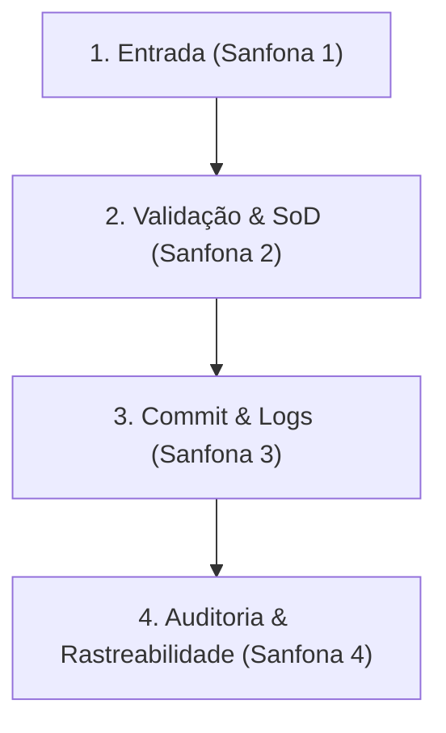

# Guia de Estudo: Mapeamento de Governança de TI e Riscos Operacionais (Matriz DICS)

Este guia serve como material de apoio didático para estudantes de sistemas de informação, administração e engenharia. Ele detalha os conceitos de governança, resiliência operacional, controle interno e integridade de dados que estruturam o módulo de **Matriz Organizacional**.

---

## 1. Estrutura Conceitual da Matriz DICS

A matriz é dividida em quatro fases lógicas de processamento e governança de uma transação corporativa:

1. **Entrada de Eventos (Fase de Input):** Identifica a transação, quem a executa, qual área é dona do processo e qual o risco inerente.
2. **Motor de Regras (Fase de Controle):** Define travas automáticas de tela e regras de alçada (limites) com segregação de funções.
3. **Persistência (Fase de Commit):** Garante a rastreabilidade histórica por meio de logs de auditoria e define como a operação sobrevive a falhas de tecnologia.
4. **Painel de Rastreabilidade:** Consolida as métricas avaliando a conformidade da transação com base nas boas práticas de governança corporativa de TI.

---

## 2. Dicionário de Campos e Instruções de Preenchimento

---

### 📂 Sanfona 1: Eventos Operacionais (Fase de Entrada)

Esta fase mapeia como a informação nasce na operação de negócio.

#### 1. Transação
* **Conceito:** Ação de negócio atômica (indivisível). Deve seguir o princípio do "tudo ou nada" — ou é processada por completo ou não deve ter efeito algum.
* **O que o aluno deve pensar:** *"Qual é a atividade crítica de negócio que gera alteração no estado da empresa ou de valores?"*
* **Exemplo Correto:** `Faturamento de pedido`, `Aprovação de limite de crédito`, `Registro de ponto`.
* **Evitar:** Nomes genéricos como `Cadastro` ou `Uso do sistema`.

#### 2. Ator de entrada
* **Conceito:** O executor direto (humano ou máquina) que realiza a inserção do dado na interface ou aciona a automação.
* **O que o aluno deve pensar:** *"Quem ou qual perfil de usuário clica no botão para enviar essa transação?"*
* **Exemplos:** `Vendedor`, `Cliente via Portal`, `Operador de Caixa`, `Robô de Conciliação (RPA)`.

#### 3. Área funcional
* **Conceito:** O departamento da empresa que responde legal e administrativamente pela qualidade daquela transação. Estabelece a propriedade da informação.
* **O que o aluno deve pensar:** *"A qual departamento pertence a responsabilidade administrativa sobre esse processo?"*
* **Exemplos:** `Comercial`, `Financeiro / Tesouraria`, `Suprimentos`, `Recursos Humanos`.

#### 4. Categoria do risco
* **Conceito:** A tipificação do impacto sofrido pela organização caso a transação seja fraudada, tenha dados vazados ou fique indisponível.
* **O que o aluno deve pensar:** *"Se esse processo falhar criticamente hoje, qual é a principal dor da empresa?"*
* **Opções Mapeadas:**
  * **Risco operacional:** Paralisação de processos vitais (ex: fábrica parada, faturamento bloqueado).
  * **Risco financeiro:** Perda direta de capital, caixa ou aplicação de multas.
  * **Risco legal e de compliance:** Descumprimento de regulamentos e leis (ex: vazamento de dados pessoais da LGPD).
  * **Risco reputacional:** Dano severo à imagem da marca perante clientes e investidores.

---

### ⚙️ Sanfona 2: Motor de Regras (Fase de Validação)

Esta fase implementa as regras que impedem dados ruins e fraudes de ocorrerem no sistema.

#### 1. Controles de entrada de dados (Validações Sintáticas)
* **Conceito:** Travas aplicadas diretamente na tela do sistema (frontend) para impedir que digitações incorretas ou incompletas cheguem ao banco de dados.
* **O que o aluno deve pensar:** *"Como o sistema valida se a digitação do usuário está correta antes de salvar?"*
* **Exemplos:** `Impedir valor menor ou igual a zero`, `CPF deve ter exatamente 11 dígitos`, `Data de entrega não pode ser no passado`.

#### 2. Regras de negócio e aprovações (SoD)
* **Conceito:** Par lógico que associa um limite operacional (Regra de Negócio) a um controle organizacional de dupla custódia (SoD - *Segregation of Duties*). O sistema deve travar a transação caso o limite seja excedido e exigir que um perfil superior aprove, bloqueando a auto-aprovação de quem iniciou o processo.
* **O que o aluno deve pensar:** *"Qual é o limite de alçada desse operador e quem é a pessoa autorizada a liberar exceções sem que o operador possa aprovar a si mesmo?"*
* **Exemplo didático:** 
  * **Regra:** Limite de desconto de 5% por vendedor.
  * **SoD:** Descontos superiores a 5% exigem aprovação do Gerente de Vendas. O sistema valida que o UID do vendedor solicitante é diferente do UID do gerente aprovador.

---

### 💾 Sanfona 3: Rastreabilidade e Conformidade (Fase de Commit)

Esta fase lida com a auditoria histórica e a tolerância a falhas na infraestrutura do sistema.

#### 1. Trilha de auditoria e responsabilidade legal
* **Conceito:** Atributos gravados de forma imutável e automática a cada alteração no banco de dados. Serve para garantir a **não-repudiação** (o usuário não pode alegar que outra pessoa fez a transação).
* **O que o aluno deve pensar:** *"Quais informações técnicas são necessárias para provar judicialmente quem fez a transação, quando e de onde?"*
* **Métrica de Auditoria:** O sistema exige o mapeamento de **pelo menos 4 atributos** para conformidade integral.
* **Exemplos fundamentais:** `UID do Usuário`, `Timestamp no Servidor (UTC)`, `Endereço IP e Porta de Origem`, `Assinatura Digital (Hash)`.

#### 2. Diretriz de risco na queda do sistema (Failover)
* **Conceito:** A política de engenharia de software e processos adotada se o servidor principal cair. O aluno deve balancear a experiência do cliente e a receita contra o risco de fraudes offline.
* **O que o aluno deve pensar:** *"Se nossa nuvem cair no meio do dia, nós travamos as operações ou deixamos o usuário trabalhar offline assumindo o risco de fraude?"*
* **Exemplos comuns:**
  * **Modo Contingência (Buffer Local):** Salvar em cache no navegador/aplicativo e sincronizar depois. (Alta tolerância a falhas, porém assume o risco de fraudes temporárias).
  * **Bloqueio Completo:** Trava a transação e exibe mensagem de indisponibilidade. (Risco de fraude zero, porém paralisa a receita e causa insatisfação).

#### 3. Plano de continuidade operacional
* **Conceito:** O mecanismo contingencial de contorno desenhado pela área de negócios para que a atividade não pare durante um blecaute total de tecnologia.
* **O que o aluno deve pensar:** *"Como os funcionários continuarão vendendo/produzindo se faltar energia elétrica e internet por 2 horas?"*
* **Exemplos:** `Emissão de notas fiscais físicas via talão de papel com digitação posterior`, `Anotação manual de pedidos em caderno e digitação retroativa`, `Controle visual de estoque na doca`.

---

## 3. Estudo de Caso Prático Resolvido (Modelo para Alunos)

Abaixo, apresentamos o fluxo completo de cadastro para a transação crítica de **"Transferência Eletrônica Especial de Valores (TED acima de R$ 50.000)"**:

### 📄 Cadastro da Transação (Fase 1)
* **Transação:** `Transferência de valores acima do limite diário`
* **Ator de entrada:** `Cliente Pessoa Física`
* **Área funcional:** `Financeiro / Operações Bancárias`
* **Categoria do risco:** `Risco financeiro`
* **Descrição do processo:** O cliente solicita via Internet Banking a transferência de um valor que excede seu limite operacional diário cadastrado. A requisição vai para uma fila de análise de fraude e limites.

### ⚙️ Motor de Regras e Validações (Fase 2)
* **Controles de entrada de dados:**
  1. *Controle 1:* CPF do destinatário deve possuir 11 dígitos numéricos válidos.
  2. *Controle 2:* Valor da transação deve ser positivo e superior a R$ 0,01.
  3. *Controle 3:* Bloquear transferência se a conta de destino estiver sinalizada como inativa ou bloqueada.
* **Regras de negócio e aprovações (SoD):**
  * **Regra:** Operações acima de R$ 50.000 são bloqueadas automaticamente para processamento imediato em lote.
  * **SoD:** Exige liberação em duas etapas: assinatura de token pelo cliente + validação de dupla assinatura do Gerente de Contas. O sistema bloqueia a validação automatizada caso o operador da conta seja o próprio gerente solicitante (auto-aprovação impedida).

### 💾 Rastreabilidade & Persistência (Fase 3)
* **Trilha de auditoria e responsabilidade legal:**
  1. *Atributo 1:* ID Único da Conta Corrente de Origem (UID)
  2. *Atributo 2:* Data/Hora exata do registro no servidor em formato UTC (Timestamp)
  3. *Atributo 3:* Endereço IP público e dados de geolocalização do dispositivo
  4. *Atributo 4:* ID único do dispositivo cadastrado (Device ID Hash)
* **Diretriz de risco na queda do sistema:**
  * `Bloqueio Completo`. Tratando-se de transação de alta movimentação financeira e alto risco de fraude, o sistema impede qualquer processamento offline. Caso a conexão com a matriz falhe, a transferência é negada imediatamente.
* **Plano de continuidade operacional:**
  * `O cliente deve ser direcionado para atendimento humano em agência física ou central de atendimento corporativo dedicada para validação por biometria e assinatura manuscrita de autorização.`
